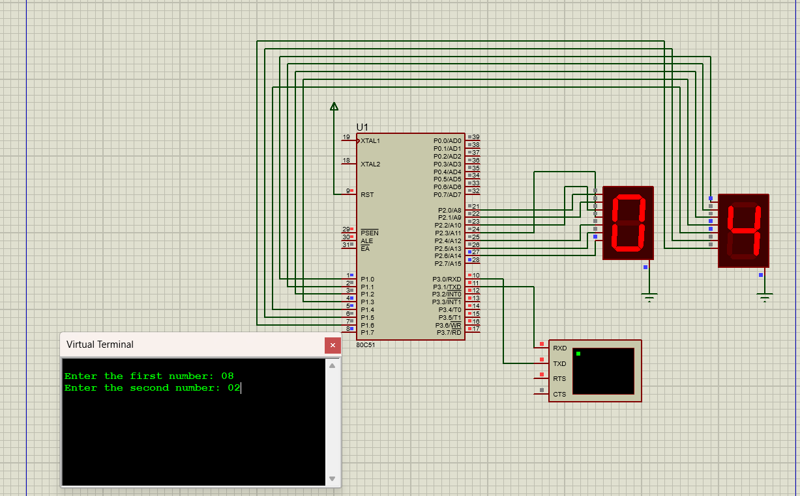

# Schematic Diagram

- This is the schematic Diagram of program15 from proteus

  

## Note here 
  - When your Entering values ...Type two digit
    if it is 0 to 9
       **==> then Type `01` or `06` or `08` etc**

## How to Upload Your program in Proteus

- step 1==> Create a Hex file and Set the Clock frequency
  ### How to Create a Hex file and Set the Clock frequency
    - **_Step 1 ==> In your Keil C program ==> Right click on Target1 (which is on the left side bar)_**
      
    - **_Step 2 ==> Select first one in the option `"Options for Targets Target1"`_**
      
    - **_Step 3 ==> Select "OUTPUT". There you can see `"Create HEX File"`, Enable it_**
      
    - **_Step 4 ==> Then Select "TARGET" from the above option (Left side of the OUTPUT), there you can see `"Xtal (MHz)"` to `11.0592` MHz and select OK_**
      
    - **_Step 5 ==> Come back to your program, Then ``Build Target files`` Your Hex files will be created_**
      
      
- step 2 ==> Go to **Proteus** Upload your Hex file to your MicroController *8051*
  ### How to Upload Hex file to your MicroController
  
    - **_Step 1 ==> Right Click on your MicroController and then select `"Edit Properties"`_**
      
    - **_Step 2 ==> There you can see `"Program Files"` Select your hex file from your File Explorer_**
      
        #### Where is your Hex file...?
         Normally it will be
        - **Go to Keil Files ==> C51 folder ==> Examples Folder ==> Hello Folder ==> Objects Folder ==> There your see you HEX file in ```.hex``` form**
           ```
           Example : your file name is Demo.c
                     Hex file will be in Demo.hex
           ```
        ##### OR
         **Go to file location where your `.c` program is saved..==> There you can see Objects foler ==> inside there will your `File_name.hex`**


    - **_Step 3 ==> Also below your Program Files there is `Clock Frequency` set it as_**
         ```
           11.0592 MHz
         ```
         
      - **_Step 4 ==> CLick Ok_**

     
## Created By

**Yadhul Mohan**  
B.Sc. in Computer Science and Electronics  
Kristu Jayanti College, Autonomous, Bengaluru, India
