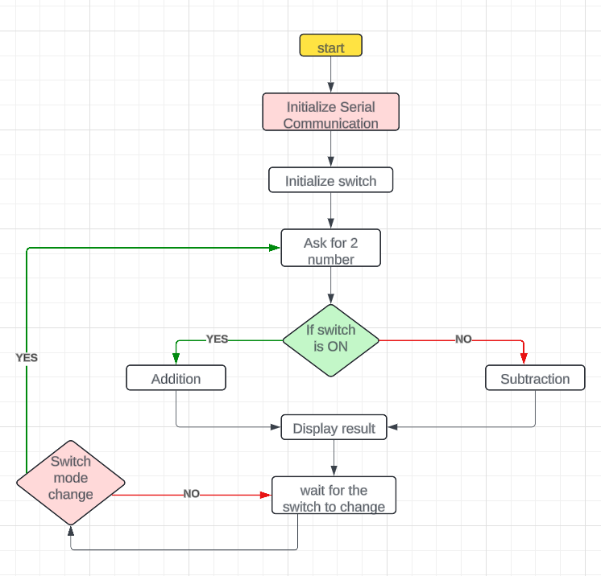

# Algorithm

1. **Start Program**

2. **Initialize Serial Communication** using `SerialInit()`.
3. **Initialize Switch State** (sw = 0).
4. **Ask for Two Numbers** from the user via `ReadBytePC()`.
5. **Check Switch State**:
   - If **switch is off** (`sw == 0`), perform **addition** and display the result.
   - If **switch is on** (`sw == 1`), perform **subtraction** and display the result.
6. **Display Instructions**:
   - Show the current state of the switch.
   - Indicate the operation based on switch state (Addition or Subtraction).
7. **Wait for Switch State Change** and update operation mode accordingly.
8. **Repeat Steps 4 to 7** for new input.
9. **End Program** (infinite loop keeps the program running).

-----------------------

# Flowchart

